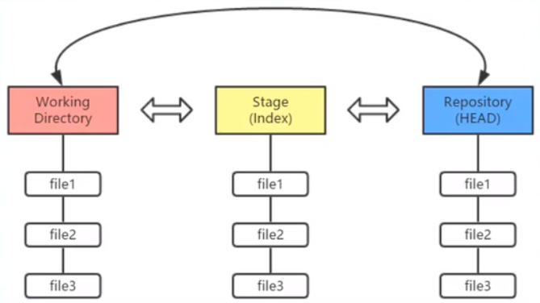
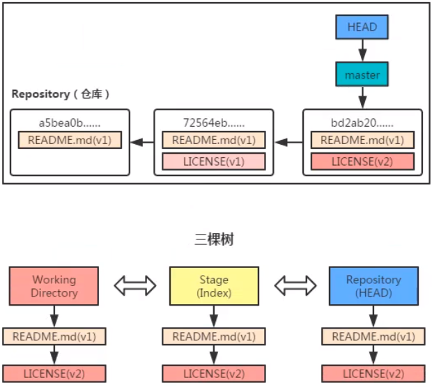

### 初次使用Git前的配置

```
git config --global user.name "username"
git config --global user.email "email"

C:\Users\WZ>git config --list
diff.astextplain.textconv=astextplain
filter.lfs.clean=git-lfs clean -- %f
filter.lfs.smudge=git-lfs smudge -- %f
filter.lfs.process=git-lfs filter-process
filter.lfs.required=true
http.sslbackend=openssl
http.sslcainfo=D:/Git/mingw64/ssl/certs/ca-bundle.crt
core.autocrlf=true
core.fscache=true
core.symlinks=false
pull.rebase=false
credential.helper=manager-core
credential.https://dev.azure.com.usehttppath=true
init.defaultbranch=master
filter.lfs.process=git-lfs filter-process
filter.lfs.required=true
filter.lfs.clean=git-lfs clean -- %f
filter.lfs.smudge=git-lfs smudge -- %f
user.name=aghb123
user.email=wangzhuang137@gmail.com //注册成功
```

###工作区域、暂存区域和Git仓库



### Git的工作流程

+ Git的工作流程一般是：
  1. 在工作目录中添加、修改文件
  2. 将需要进行版本管理的文件放入暂存区域
  3. 将暂存区域的文件提交到Git仓库
+ Git管理的文件有三种状态：
  1. 已修改（modified）
  2. 已暂存（staged）
  3. 已提交（committed）

### 练习

1. 创建仓库

```
G:\github\Git_test>git init
Initialized empty Git repository in G:/github/Git_test/.git/
```

2. 添加文件

```markdown
G:\github\Git_test>git add README.md //将文件加入暂存区

G:\github\Git_test>git commit -m "add a readme file" //将文件提交到仓库，附加说明
[master (root-commit) 3e76ed6] add a readme file
 1 file changed, 1 insertion(+)
 create mode 100644 README.md
```

3. 查看状态

`git status`

```markdown
G:\github\Git_test>git status
On branch master
nothing to commit, working tree clean
//添加LICENSE文件
G:\github\Git_test>git status
On branch master
Untracked files:
  (use "git add <file>..." to include in what will be committed)
        LICENSE

nothing added to commit but untracked files present (use "git add" to track)

//撤销将LICENSE添加到暂存区
G:\github\Git_test>git restore --staged LICENSE

G:\github\Git_test>git status
On branch master
Untracked files:
  (use "git add <file>..." to include in what will be committed)
        LICENSE

nothing added to commit but untracked files present (use "git add" to track)

//修改README.md
G:\github\Git_test>git status
On branch master
Changes not staged for commit:
  (use "git add <file>..." to update what will be committed)
  (use "git restore <file>..." to discard changes in working directory)
        modified:   README.md

no changes added to commit (use "git add" and/or "git commit -a")

G:\github\Git_test>git restore README.md //撤销工作区的修改

//修改README.md之后，再加入到暂存区，然后再修改README.md
G:\github\Git_test> git status
On branch master
Changes to be committed:
  (use "git restore --staged <file>..." to unstage)
        modified:   README.md

Changes not staged for commit:
  (use "git add <file>..." to update what will be committed)
  (use "git restore <file>..." to discard changes in working directory)

G:\github\Git_test>git status -s //简短模式查看状态
MM README.md

G:\github\Git_test>git add README.md

G:\github\Git_test>git status -s
M  README.md

//查看日志
G:\github\Git_test>git log
commit 3b73f3432d9da32413cda486b553a1244a1473ae (HEAD -> master)
Author: aghb123 <wangzhuang137@gmail.com>
Date:   Wed Jan 20 17:00:53 2021 +0800

    modified README.md

commit e4fd1f34e645f031a8c012fc370f099f1abaf78b
Author: aghb123 <wangzhuang137@gmail.com>
Date:   Wed Jan 20 16:28:11 2021 +0800

    add LICENSE

commit 3e76ed6b35181f2b31e8084477a7be30ccaefb9a
Author: aghb123 <wangzhuang137@gmail.com>
Date:   Wed Jan 20 16:04:14 2021 +0800

    add a readme file
```

### 撤销操作




#### `git reset`

reset 重新设置的意思，其实就是用来设置分支的头部指向，当进行了一系列的提交之后，忽然发现最近的几次提交有问题，想从提交记录中删除，这是就会用到 `git reset` 命令，这个命令后面跟 `commit id`，表示当前分支回退到这个 `commit id` 对应的状态，之后的日志记录被删除，工作区中的文件状态根据参数的不同会恢复到不同的状态。

- `--soft`: 被回退的那些版本的修改会被放在暂存区，可以再次提交。
- `--mixed`: 默认选项，被回退的那些版本的修改会放在工作目录，可以先加到暂存区，然后再提交。
- `--hard`: 被回退的那些版本的修改会直接舍弃，好像它们没有来过一样。

这样来看，`git reset` 命令好像是用来回退版本的，但是如果使用 `git reset HEAD file_name` 命令就可以将一个文件回退到 `HEAD` 指向版本所对应的状态，其实就是当前版本库中的状态，也就相当于还原了本地的修改。

`reset`命令回滚快照过程

1. 移动HEAD的指向(--soft)
2. 将快照回滚到暂存区域([--mixed],默认)
3. 将暂存区域还原到工作目录(--hard)


**`reset`回滚指定快照***

`git reset 版本快照的ID号`


**`reset`回滚个别文件**

`git reset 版本快照 文件名/路径`

### 版本对比

1. 比较暂存区域与工作目录

`git diff`

2. 比较两个历史快照

`git diff 快照1ID 快照2ID`

3. 比较当前工作目录和Git仓库中的快照

`git diff 快照ID`

4. 比较暂存区域和Git仓库快照

`git diff --cached [快照ID]`


### 修改最后一次提交

+ 在实际开发中，可能遇到以下两种情景：

  ——情景一：版本刚一提交(commit)到仓库，突然想起漏掉两个文件还没有添加(add)

  ——情景二：版本刚一提交(commit)到仓库，突然想起版本说明写得不够全面，无法彰显本次修改的重大意义