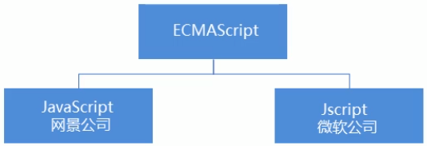
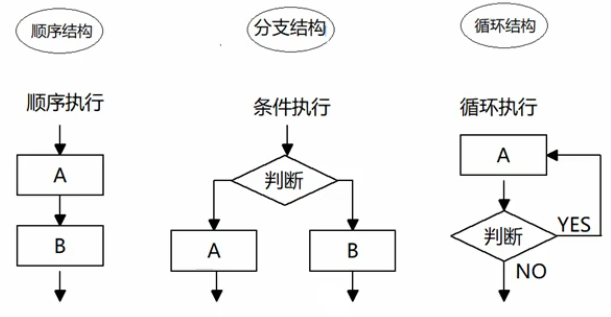

## 初识JavaScript

### JavaScript是什么

+ javascript是一种运行在客户端的脚本语言
+ 脚本语言：不需要编译，运行过程中由js解释器(js引擎)逐行进行解释并执行
+ 现在也可以基于Node.js技术进行服务器端编程

### JavaScript的作用

+ 表单动态校验(密码强度检测)(js产生最初的目的)
+ 网页特效
+ 服务端开发(Node.js)
+ 桌面程序(Electron)
+ App(Cordova)
+ 控制硬件-物联网(Ruff)
+ 游戏开发(cocos2d-js)

### HTML/CSS/JS的关系

HTML/CSS标记语言--描述类语言

+ HTML决定网页结构和内容(决定看到什么)，相当于人的身体
+ CSS决定网页呈现给用户的模样(决定好不好看)，相当于给人穿衣服、化妆

JS脚本语言--编程类语言

实现业务逻辑和页面控制(决定功能)，相当于人的各种动作

### 浏览器执行JS简介

浏览器分成两部分：渲染引擎和JS引擎

+ 渲染引擎：用来解析HTML与CSS，俗称内核，比如chrome浏览器的blink，老版本的webkit
+ JS引擎：也称为JS解释器。用来读取网页中的javascript代码，对其处理后运行，比如chrome浏览器的V8

浏览器本身并不会执行JS代码，而是通过内置JavaScript引擎(解释器)来执行JS代码。JS引擎执行代码时逐行解释每一句源码(转换为机器语言)，然后由计算机去执行，所以JavaScript语言归为脚本语言，会逐行解释执行

### JS的组成


1. ECMAScript是由ECMA国际(原欧洲计算机制造商协会)进行标准化的一门编程语言，这种语言在万维网上应用广泛，它往往被称为JavaScript或JScript，但实际上后两者是ECMAScript语言的实现和扩展



ECMAScript:规定了JS的编程语法和基础核心知识，是所有浏览器厂商共同遵守的一套JS语法工业标准。

2. DOM——文档对象模型

文档对象模型(Document Object Model，简称DOM)，是W3C组织推荐的处理可扩展标记语言的标准编程接口。通过DOM提供的接口可以对页面上的各种元素进行操作(大小、位置、颜色等)

3. BOM——浏览器对象模型

BOM(Browser Object Model，简称BOM)是指浏览器对象模型，它提供了独立于内容的、可以与浏览器窗口进行互动的对象结构。通过BOM可以操作浏览器窗口，比如弹出框、控制浏览器跳转、获取分辨率等

### JS初体验

JS有三种书写位置，分别为行内、内嵌和外部

1. 行内式JS

```javascript
<input type="button" value="点我试试" onclick="alert('Hello World')" />
```

​	(1)可以将单行或少量JS代码写在HTML标签的事件属性中(以on开头的属性)，如:onclick

​	(2)注意单双引号的使用：在HTML中推荐使用双引号，JS中推荐使用单引号

​	(3)可读性差，在html中编写JS大量代码时，不方便阅读

​	(4)引号易错，引号多层嵌套匹配时，非常容易弄混

​	(5)特殊情况下使用

2.  内嵌JS

```javascript
<script>
	alert('Hello World!');    
</script>
```

​	(1)可以将多行JS代码写到<script>标签中

​	(2)内嵌JS是学习时常用的方式

3. 外部JS文件

```javascript
<script src="my.js"></script> 
```

​	(1)利用HTML页面代码结构化，把大段JS代码独立到HTML页面之外，既美观，也方便文件级别的复用

​	(2)引用外部JS文件的script标签中间不可以写代码

​	(3)适合于JS代码量比较大的情况

### 注释快捷键

单行注释 ctrl + /

多行注释 shift + alt + a(默认) vscode中修改多行注释的快捷键 ctrl + shift + /

### JavaScript输入输出语句

为了方便信息的输入输出，JS中提供了一些输入输出语句，其常用的语句如下：

| 方法                | 说明                           | 归属   |
| ------------------- | ------------------------------ | ------ |
| `alert(msg);`       | 浏览器弹出警示框               | 浏览器 |
| `console.log(msg);` | 浏览器控制台打印输出信息       | 浏览器 |
| `prompt(info);`     | 浏览器弹出输入框，用户可以输入 | 浏览器 |

## 变量

变量：用于存放数据的容器，通过变量名获取数据，甚至数据可以修改

本质：变量是程序在内存中申请的一块用来存放数据的空间

变量在使用时分为两步：1.声明变量 2.赋值

### 声明变量

```javascript
var age;
```

+ `var`是一个JS关键字，用来声明变量(variable变量的意思)。使用该关键字声明变量后，计算机会自动为变量分配内存空间
+ age是程序员定义的变量名，要通过变量名来访问内存中分配的空间

```javascript
var age = 18;
```

声明一个变量并赋值，称之为变量的初始化

### 变量语法扩展

1. 更新变量

一个变量被重新赋值后，它原有的值就会被覆盖，变量值将以最后一次赋的值为准

2. 同时声明多个变量

同时声明多个变量时，只需要写一个var，多个变量名之间使用英文逗号隔开

```javascript
var age = 10, name = 'wz', sex = 2;
```

3. 声明变量的特殊情况

| 情况                          | 说明                   | 结果      |
| ----------------------------- | ---------------------- | --------- |
| `var age; console.log(age);`  | 只声明 不赋值          | undefined |
| `console.log(age);`           | 不声明 不赋值 直接使用 | 报错      |
| `age = 10; console.log(age);` | 不声明 只赋值          | 10        |

### 变量命名规范

+ 由字母(A-Z,a-z)、数字(0-9)、下划线(_)、美元符号($)组成，如：usrAge,num01,__name
+ 严格区分大小写，var app;和var App;是两个变量
+ 不能以数字开头，18age 是错误的
+ 不能是关键字、保留字。例如var、for、while
+ 变量名必须有意义。MMD BBD
+ 遵守驼峰命名法。首字母小写，后面单词的首字母需要大写。myFirstName

## 数据类型

### 变量的数据类型

变量是用来存储值的所在处，有名字和数据类型。变量的数据类型决定了如何将代表这些值的位存储到计算机的内存中。JavaScript是一种弱类型或者说动态语言。这意味着不用提前声明变量的类型，在程序运行过程中，类型会被自动确定。

```javascript
var age = 10;
var str = 'abc';
```

在代码运行时，变量的数据类型是由JS引擎根据`=`右边变量值的数据类型来判断的，运行完毕之后，变量就确定了数据类型。

JavaScript拥有动态类型，同时也意味着相同的变量可用作不同的类型

```javascript
var x = 6;
x = 'Bill';
```

### 数据类型的分类

JS把数据类型分为两类：

+ 简单数据类型(`Number,String,Boolean,Undefined,Null`)
+ 复杂数据类型(`object`)

| 简单数据类型 | 说明                                                    | 默认值    |
| ------------ | ------------------------------------------------------- | --------- |
| `Number`     | 数字型，包含整型值和浮点型值，如21、0.21                | 0         |
| `Boolean`    | 布尔值类型，如`true、false`，等价于1和0                 | false     |
| `String`     | 字符串类型，注意JS里面，字符串都带引号                  | ''        |
| `Undefined`  | `var a;` 声明了变量a，但是没有给值，此时`a = undefined` | undefined |
| `Null`       | `var a = null;` 声明了变量a为空值                       | null      |

#### 数字型Number

1. 数字型进制

最常见的进制有二进制、八进制、十进制、十六进制

```javascript
// 1. 八进制 0 ~ 7 程序里面数字前面加0 表示八进制
var num1 = 010;
console.log(num1);
// 2. 十六进制 0 ~ 9 a ~ f 数字的前面加0x表示十六进制
var num3 = 0x9a;
console.log(num3)
```

在JS中八进制前面加`0`，十六进制前面加`0x`

2. 数字型范围

JavaScript中数值的最大和最小值

```javascript
// 3.数字型的最大值
console.log(Number.MAX_VALUE); // 1.7976931348623157e+308
// 4. 数字型的最小值
console.log(Number.MIN_VALUE); // 5e-324
```

3. 数字型的三个特殊值

```javascript
// 5. 无穷大
console.log(Number.MAX_VALUE * 2); // Infinity 无穷大
// 6. 无穷小
console.log(-Number.MAX_VALUE * 2); // -Infinity 无穷小
// 7. 非数字
console.log('abc' - 100); // NaN
```

+ Infinity,代表无穷大，大于任何数值
+ -Infinity,代表无穷小，小于任何数值
+ NaN，Not a number,代表一个非数值

4. isNaN()

这个方法用来判断非数字 并且返回一个值 如果是数字返回的是false 如果不是数字返回的是true

#### 字符串型 `String`

字符串型可以是引号中的任意文本，其语法为双引号""和单引号''

1. 字符串引号嵌套

JS可以用单引号嵌套双引号，或者用双引号嵌套单引号(外双内单，外单内双)

```javascript
var strMsg = 'abc"de"fgh';
var strMsg2 = "abc'de'fgh";
```

2. 字符串转义符

类似HTML中的特殊字符，字符串中也有特殊字符，称之为转义符

转义符都是`\`开头的，常用的转义符及其说明如下：

| 转义符 | 解释说明                     |
| ------ | ---------------------------- |
| `\n`   | 换行符， n 是 newline 的意思 |
| `\\`   | 斜杠 \                       |
| `\'`   | ' 单引号                     |
| `\"`   | " 双引号                     |
| `\t`   | tab 缩进                     |
| `\b`   | 空格 ， b 是 blank的意思     |

3. 字符串长度

字符串是由若干个字符组成的，这些字符的数量就是字符串的长度，通过字符串的`length`属性可以获取整个字符串的长度

4. 字符串拼接

+ 多个字符串之间可以使用`+`进行拼接，其拼接方式为`字符串 + 任何类型 = 拼接之后的新字符串`
+ 拼接前会把与字符串相加的任何类型转成字符串，再拼接成一个新的字符串

5. 字符串拼接加强

+ 经常会将字符串和变量来拼接，因为变量可以很方便地修改里面地值
+ 变量是不能添加引号的，因为加引号的变量会变成字符串

#### 布尔型 `Boolean`

布尔类型有两个值：true和false，其中true表示真，而false表示假

布尔型和数字型相加时，true的值为1，false的值为0

#### `Undefined`和`Null`

一个声明后没有被赋值的变量会有一个默认值undefined(如果进行相连或者相加时，注意结果)

```javascript
var variable = undefined;
console.log(variable + 'pink'); // undefinedpink
console.log(variable + 1); // NaN
```

一个声明变量给null值，里面存的值为空

```javascript
var space = null;
console.log(space + 'pink'); // nullpink
console.log(space + 1); // 1
```

### 获取检测变量的数据类型

1. `typeof`可用来获取检测变量的数据类型

```javascript
var num = 10;
console.log(typeof num); // number
var str = 'pink';
console.log(typeof str); // string
```

2. 字面量

字面量是在源代码中一个固定值的表示法，通俗来说，就是字面量表示如何表达这个值

+ 数字字面量：8，9，10
+ 字符串字面量：'南京'，"长沙"
+ 布尔字面量：true，false

### 数据类型转换

使用表单、prompt获取过来的数据默认是字符串类型的，此时就不能简单的进行加法运算。而需要转换变量的数据类型。通俗来说，就是把一种数据类型的变量转换成另外一种数据类型

通常会实现3种方式的转换：

+ 转换为字符串类型
+ 转换为数字型
+ 转换为布尔型

#### 转换为字符串

| 方式               | 说明                         | 案例                                 |
| ------------------ | ---------------------------- | ------------------------------------ |
| `toString()`       | 转成字符串                   | var num = 1; alert(num.toString());  |
| `String()`强制转换 | 转成字符串                   | var num = 1; alert(String(num));     |
| 加号拼接字符串     | 和字符串拼接的结果都是字符串 | var num = 1; alert(num + '字符串')； |

+ `toString()`和`String()`使用方式不一样
+ 三种转换方式，更喜欢用第三种拼接字符串转换方式，这一种方式也称之为隐式转换

#### 转换为数字型(重点)

| 方式                 | 说明                         | 案例                |
| -------------------- | ---------------------------- | ------------------- |
| `parseInt(string)`   | 将string类型转换为整数数字型 | parseInt('78')      |
| `parseFloat(string)` | 将string类型转换为浮点数字型 | parseFloat('78.21') |
| `Number()`强制转换   | 将string类型转换为数字型     | Number('12')        |
| js隐式转换(- * /)    | 利用算术运算隐式转换为数字型 | '12' - 0            |

#### 转换为布尔型

| 方式        | 说明               | 案例             |
| ----------- | ------------------ | ---------------- |
| `Boolean()` | 其它类型转成布尔值 | Boolean('true'); |

+ 代表空、否定的值会被转换为false，如''、0、NaN、null、undefined
+ 其余值都会被转换为true

## 运算符

### 算术运算符

| 运算符 | 描述         |
| ------ | ------------ |
| `+`    | 加           |
| `-`    | 减           |
| `*`    | 乘           |
| `/`    | 除           |
| `%`    | 取余数(取模) |

浮点数值的最高精度是17位小数，但在进行算术计算时其精确度远远不如整数

```javascript
var result = 0.1 + 0.2; // 0.30000000000000004
var res = 0.07 * 100; // 7.000000000000001
```

所以：不要直接判断两个浮点数是否相等

#### 表达式和返回值

表达式：是由数字、运算符、变量等以能求得数值的有意义排列方法所得的组合

简单理解：是由数字、运算符、变量等组成的式子

### 递增和递减运算符概述

如果需要反复给数字变量添加或减去1，可以使用递增(++)和递减(--)运算符来完成。

### 比较运算符

| 运算符名称  | 说明                        | 案例       | 结果  |
| ----------- | --------------------------- | ---------- | ----- |
| `==`        | 判等号(会转型)              | 18 == '18' | true  |
| `===` `!==` | 全等 要求值和数据类型都一致 | 18 == '18' | false |

### 逻辑运算符

#### 短路运算(逻辑中断)

原理:当有多个表达式(值)时，左边的表达式值可以确定结果时，就不再继续运算右边的表达式的值

逻辑与短路运算：如果左边的表达式结果为真 则返回右边表达式 如果左边表达式为假，那么返回左边表达式

逻辑或

+ 语法：表达式1 || 表达式2
+ 如果第一个表达式的值为真，则返回表达式1
+ 如果第一个表达式的值为假，则返回表达式2

```javascript
console.log(123 || 456); // 123
console.log(0 || 456); // 456
console.log(123 || 456 || 789); // 123
```

### 赋值运算符

| 赋值运算符    | 说明                 | 案例                          |
| ------------- | -------------------- | ----------------------------- |
| `=`           | 直接赋值             | var usrName = 'abc';          |
| `+=、-=`      | 加、减一个数后再赋值 | var age = 10; age += 5; // 15 |
| `*=、/=、%=*` | 乘、除、取模后再赋值 | var age = 2; age *= 5; // 10  |

### 运算符优先级

| 优先级 | 运算符     | 顺序             |
| ------ | ---------- | ---------------- |
| 1      | 小括号     | ()               |
| 2      | 一元运算符 | ++ -- !          |
| 3      | 算术运算符 | 先 * / % 后 + -  |
| 4      | 关系运算符 | > >= < <=        |
| 5      | 相等运算符 | == != ===  `!==` |
| 6      | 逻辑运算符 | 先 && 后 \|\|    |
| 7      | 赋值运算符 | =                |
| 8      | 逗号运算符 | ,                |

+ 一元运算符里面的逻辑非优先级很高
+ 逻辑与比逻辑或优先级高

## 流程控制

主要有三种结构，分别是==顺序结构==、==分支结构==和==循环结构==



### 顺序结构

按照代码的先后顺序，依次执行

### 分支结构

JS语言提供了两种分支结构语句

+ ==if语句==
+ ==switch语句==

#### switch语句

```javascript
switch(表达式) {
    case value1:
        执行语句1；
        break;
    case value2:
        执行语句2；
        break;
    ...
    default:
    	执行最后的语句；
}
```

1. 表达式常写成变量
2. 表达式和value值相匹配的时候是全等，必须是值和数据类型都一致
3. 如果当前的case里面没有break 则不会退出switch 而是继续执行下一个case

## 命名规范以及语法格式

### 标识符命名规范

+ 变量、函数的命名必须要有意义
+ 变量的名称一般用名词
+ 函数的名称一般用动词

### 操作符规范

操作符左右两侧各保留一个空格

## 数组

### 创建数组

#### 利用new创建数组

```javascript
var arr = new Array();
```

#### 利用数组字面量创建数组

```javascript
var arr = [];
var arr1 = [1,2,'abc',true];
```

+ ==js中数组可以同时存放不同数据类型的值==
+ 声明数组并赋值称为数组的初始化
+ 数组的字面量是方括号{}

###数组长度

`arr.length`

### 数组中新增元素

#### 通过修改==length==长度新增数组元素

+ 可以通过修改length长度来实现数组扩容的目的
+ ==length==属性是可读写的

#### 通过修改索引号 追加数组元素

```javascript
var arr1 = ['red','green','blue'];
arr1[3] = 'pink';
```

## 函数

### 函数使用

1. 声明函数

```javascript
function 函数名() {
    //函数体
}
```

2. 调用函数

 ### 形参和实参

| 参数 | 说明                                                 |
| ---- | ---------------------------------------------------- |
| 形参 | 形式上的参数 函数定义的时候 传递的参数               |
| 实参 | 实际上的参数 函数调用时传递的参数 实参是传递给形参的 |

形参和实参匹配问题

1. 如果实参的个数和形参的个数一致，则正常输出结果
2. 如果实参的个数多于参的个数，会取到形参的个数
3. 如果实参的个数小于形参的个数，多余的形参就是没有值的变量undefined

### 函数返回值

如果有`return` 则返回的是return后面的值 如果函数没有return 则返回undefined

### `arguments`的使用

当不确定有多少个参数传递的时候，可以用`arguments`来获取。在JavaScript中，arguments实际上是当前函数的一个内置对象。所有函数都内置了一个arguments对象，arguments对象中存储了传递的所有实参

arguments展现形式是一个伪数组，因此可以进行遍历。伪数组具有以下特点

+ 具有`length`属性
+ 按索引方式储存数据
+ 不具有数组的push，pop等方法

### 函数的两种声明方式

1. 利用函数关键字自定义函数(命名函数)

```javascript
function fn() {}
```

2. 函数表达式(匿名函数)

```javascript
var fun = function(){};
```

+ `fun`是变量名 不是函数名
+ 函数表达式声明方式跟声明变量差不多 只不过变量里面存的是值 而函数表达式里面存的是函数
+ 函数表达式也可以进行传递参数

## 作用域

通常来说，一段程序代码中所用到的名字并不总是有效和可用的，而限定这个名字的可用性的代码范围就是这个名字的作用域。作用域的使用提高了程序逻辑的局部性，增强了程序的可靠性，减少了名字冲突。

### 变量作用域的分类

+ 全局变量
+ 局部变量

#### 全局变量

在全局作用域下声明的变量叫做全局变量(在函数外部定义的变量)

+ 全局变量在代码的任何位置都可以使用
+ 在全局作用域下`var`声明的变量是全局变量
+ 特殊情况下，在函数内不适用`var`声明的变量也是全局变量(不建议使用)

#### 局部变量

在局部作用域下声明的变量叫做局部变量(在函数内部定义的变量)

+ 局部变量只能在该函数内部使用
+ 在函数内部`var`声明的变量是局部变量
+ 函数的形参实际上就是局部变量

#### 全局变量和局部变量的区别

+ 全局变量：在任何一个地方都可以使用，只有在浏览器关闭时才会被销毁，因此比较占内存
+ 局部变量：只在函数内部使用，当其所在的代码块被执行时，会被初始化；当代码块运行结束后，就会被销毁，因此更节省内存空间

### 作用域链

+ 只要是代码，就至少有一个作用域
+ 写在函数内部的局部作用域
+ 如果函数中还有函数，那么在这个作用域中就又诞生一个作用域
+ 根据在内部函数可以访问外部函数变量的这种机制，用链式查找决定哪些数据能被内部函数访问，就称作作用域链

## JavaScript预解析

JS代码是由浏览器中的JS解析器来执行的。JS解析器在运行JS代码的时候分为两步：预解析和代码执行

预解析：js引擎会把js里面所有的var还有function提升到当前作用域的最前面

代码执行：按照代码书写的顺序从上往下执行

预解析分为 变量预解析(变量提升) 和 函数预解析(函数提升)

==变量提升== 就是把所有的变量声明提升到当前作用域最前面 不提升赋值操作

==函数提升== 就是把所有的函数声明提升到当前作用域的最前面 不调用函数

函数表达式 调用必须写在函数表达式的下面

经典案例：

```javascript
var num = 10;
fun();
function fun() {
    console.log(num);
    var num = 20;
}

//预解析完后
var num;
function fun() {
    var num;
    console.log(num);
    num = 20;
}
num = 10;
fun();

//最后输出undefined
```

```javascript
f1();
console.log(c);
console.log(b);
console.log(a);
function f1() {
    var a = b = c = 9;
    console.log(a);
    console.log(b);
    console.log(c);
}
//预解析完后
function f1() {
    var a;
    a = b = c = 9;
    // 相当于 var a = 9; b = 9; c = 9;
    //集体声明 var a = 9, b = 9, c = 9;
    console.log(a);
    console.log(b);
    console.log(c);
}
f1();
console.log(c);
console.log(b);
console.log(a);

//结果：9 9 9 9 9 a is not defined
```


